# LD Intelligence

<div align="center">

**He thong QA intelligence cho doi LD: scan du lieu labeler, tong hop loi QA, hoi dap AI ve annotation vach ke duong va ve minh hoa loi theo ngu canh.**

<p>
  
  
  
  
  
</p>

<p align="center">
  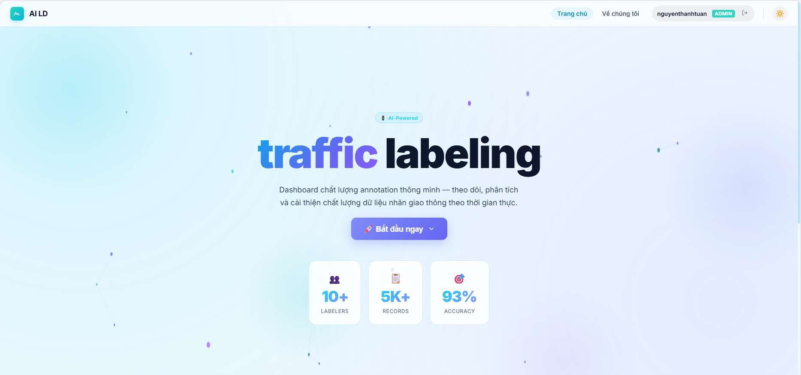
</p>

<p>
  <a href="#tong-quan">Tong quan</a> |
  <a href="#module-chinh">Module chinh</a> |
  <a href="#flow-ai-ld">Flow AI LD</a> |
  <a href="#flow-scan-qa">Flow scan QA</a> |
  <a href="#quick-start">Quick start</a> |
  <a href="#public-safe">Public-safe</a>
</p>

</div>

---

## Tong Quan

LD Intelligence la mot he thong full-stack duoc build de bien workflow QA annotation thanh mot dashboard co the theo doi, phan tich va hoc lai tu loi that. He thong gom 3 phan chinh: scanner backend cho du lieu QA, dashboard hieu suat labeler, va LD AI de hoi dap/quy chieu tri thuc/chuyen loi thanh minh hoa truc quan.

```text
LD Platform data -> Backend QA Scanner -> data/user + data/report -> QA Dashboard
                                             |
                                             v
                                  LD AI + Knowledge + Drawing
```

Repo nay chi nen chua source code, cau hinh mau va tai lieu public-safe. Cookie, session, token, API key, report scan that va tai lieu noi bo phai duoc giu ngoai Git.

| Layer | Thanh phan | Vai tro |
| :--- | :--- | :--- |
| Frontend | React, Vite, Plotly, Pixi/Canvas | Dashboard QA, Performance, Chat LD, Knowledge va view loi theo user |
| Backend | FastAPI, Pydantic, Python services | Auth, scanner orchestration, report aggregation, AI endpoints, docs ingestion, drawing endpoints |
| QA Scanner | `backend/services/qa_scanner` | Dang nhap/chuan bi session, lay full data, loc loi QA, ghi summary va report theo username |
| AI Core | `backend/services/ld_ai`, `ld_orchestrator.py` | Domain guard, intent parser, RAG, core answer builder, LLM polish, validation, memory feedback |
| Drawing | `drawing_engine.py`, `LaneCanvas` | Sinh instruction ve vach/lane/loi de frontend render minh hoa |
| Storage | `data/user`, `data/report`, `data/scanner`, `data/ld_memory` | Runtime data khi chay local/server, khong phai noi luu secret tren Git |

---

## Module Chinh

| Module | Man hinh / API | Gia tri chinh |
| :--- | :--- | :--- |
| Login LD | `/login`, `/api/auth/login` | User chi nhap username; backend xu ly chuan hoa tai khoan, xac thuc va tra ve phien dang nhap |
| QA Dashboard | `/dashboard`, `/api/qa/accounts` | Tong quan data, record, accuracy, loi, top loi va danh sach user |
| User Detail | Dashboard detail | Hien user id, worker id, tong data, tong record, pass/error, accuracy va top issue cards |
| Performance | `/performance`, `/api/ld/dashboard/chart` | Bieu do hieu suat, pass/error, ranking va loi pho bien theo du lieu thuc |
| Chat LD | `/chat`, `/api/ld/chat/stream` | Hoi dap AI theo domain annotation, co stream text, image input, references va drawing |
| Knowledge | `/knowledge`, `/api/ld/docs`, `/api/ld/docs/upload` | Upload/list tai lieu, ingest tri thuc va lam nguon RAG cho AI |
| Drawing API | `/api/ld/drawing`, `/api/ld/draw` | Sinh cau truc ve minh hoa cho loi QA va cau hoi chat |
| Feedback Memory | `/api/ld/feedback`, `/api/ld/variant-selection` | Luu feedback, variant duoc chon va lich su QA de AI hoc lai tu ngu canh |

---

## Giao Dien & Minh Hoa

Toan bo anh trong README duoc lay tu `docs/images/` de dong bo voi bo anh da chup trong repo.

### Trang chu va dang nhap

| Home | Login |
| :--- | :--- |
|  | 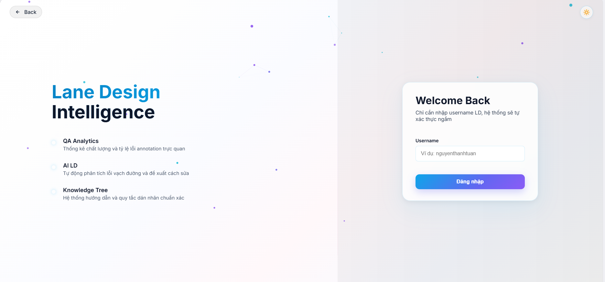 |

### Dashboard va hieu suat

| Dashboard user | Dashboard admin | Hieu suat |
| :--- | :--- | :--- |
| 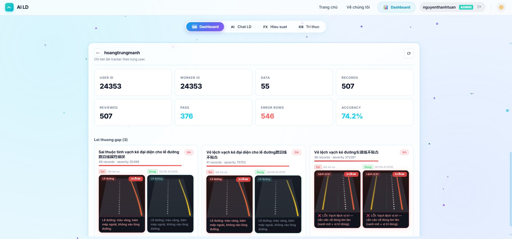 | 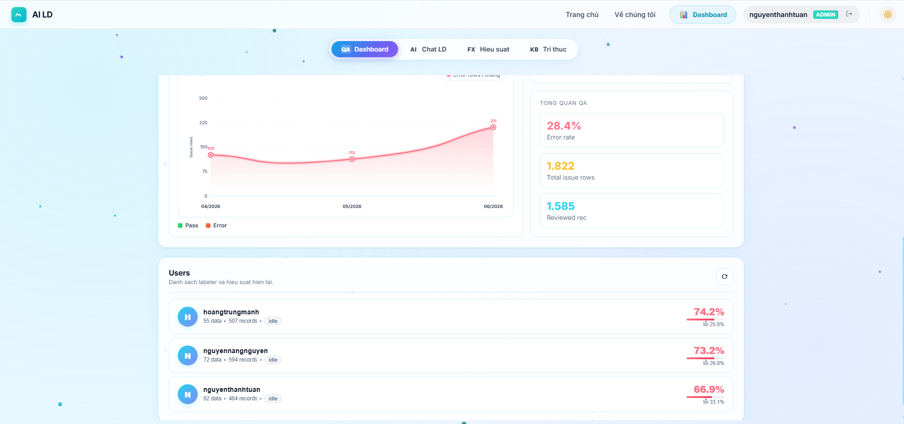 | 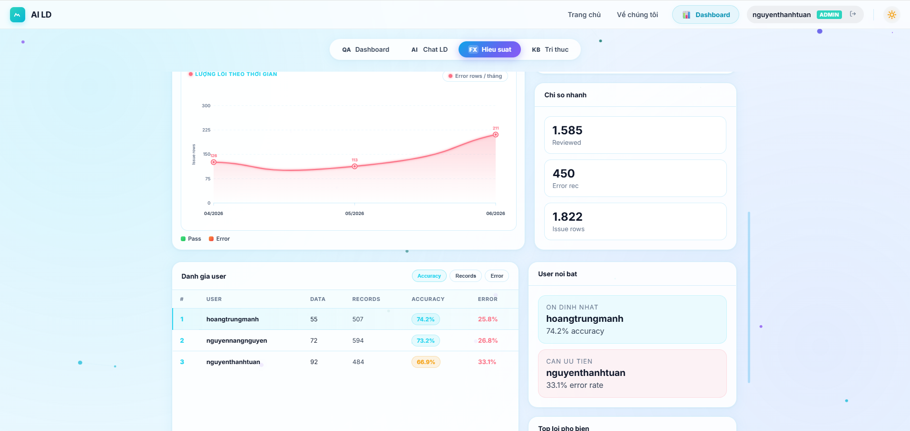 |

### Tri thuc va AI LD

| Tri thuc | AI flow | AI architecture |
| :--- | :--- | :--- |
| 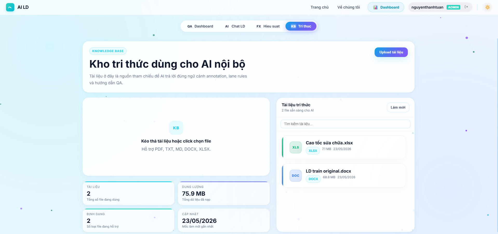 | 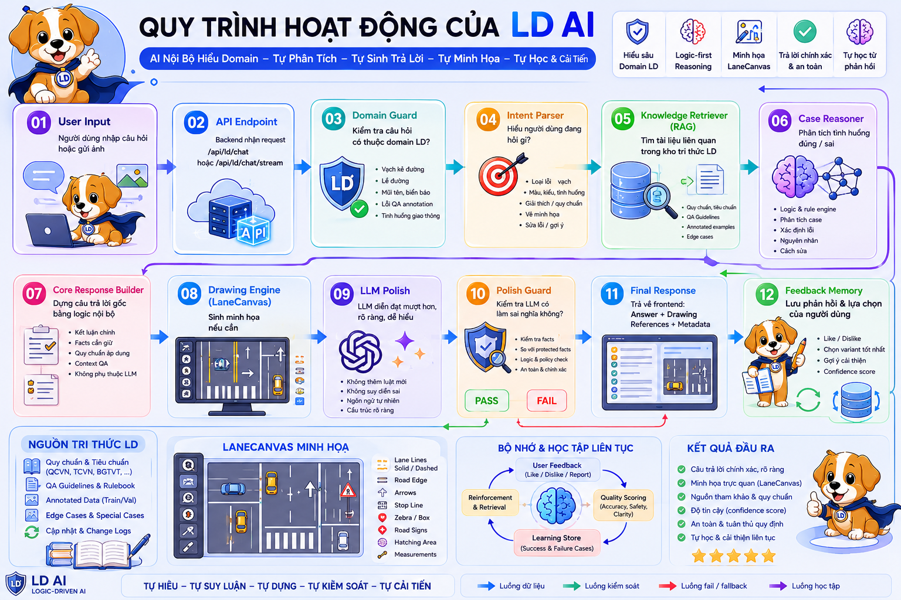 | 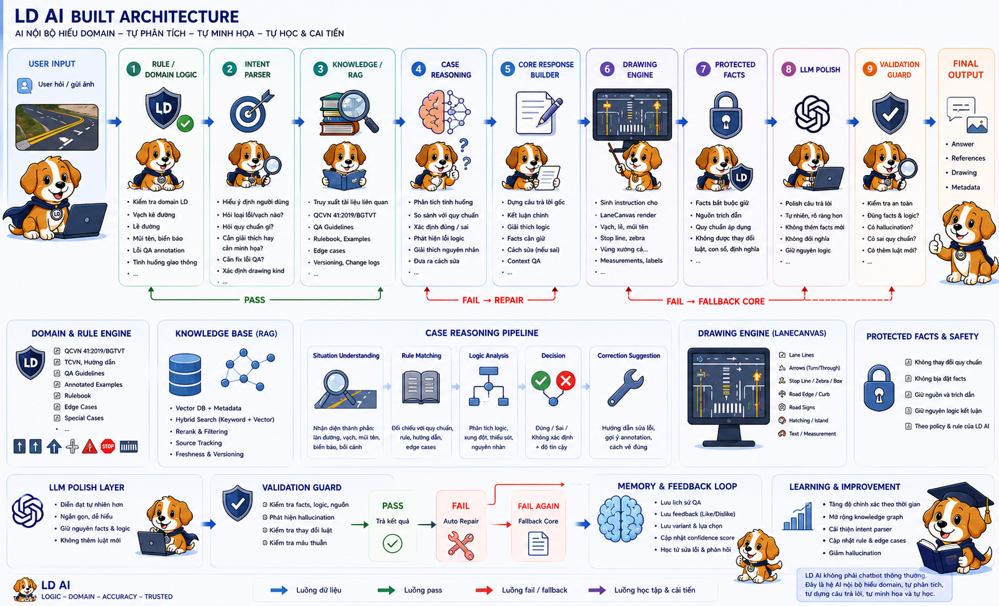 |

### Tong quan he sinh thai

| AI-LD |
| :--- |
| 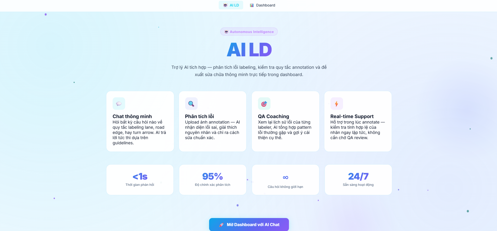 |

## Flow AI LD

LD AI khong duoc build nhu mot chatbot goi model truc tiep. Ban chat cua no la mot pipeline tu build cau tra loi noi bo truoc, sau do moi cho LLM polish co kiem soat. Cach nay giup he thong giu dung quy tac annotation, tranh model tu bia them luat, va van co cau tra loi tu nhien cho nguoi dung.

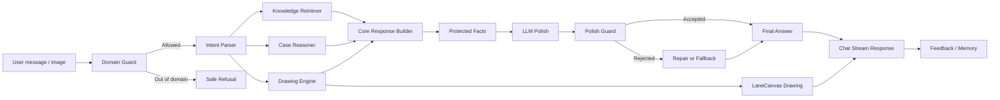

### AI duoc build nhu the nao

| Buoc | Service | Y nghia |
| :--- | :--- | :--- |
| Domain guard | `services/ld_ai/domain_guard.py` | Chi cho phep cau hoi lien quan den vach ke duong, le duong, mui ten, bien bao mat duong va loi QA annotation |
| Intent parser | `services/ld_ai/intent_parser.py` | Tach cau hoi thanh marking type, request type, color hint, nhu cau giai thich dai/ngan va drawing kind |
| Knowledge retrieval | `services/ld_ai/knowledge_retriever.py` | Lay tai lieu lien quan tu docs index de cau tra loi co can cu noi bo |
| Case reasoning | `services/ld_ai/case_reasoner.py` | Phan tich tinh huong loi, quy tac dung/sai va huong sua |
| Core response | `services/ld_ai/response_builder.py` | Dung cau tra loi goc bang logic noi bo, tao protected facts bat buoc giu nguyen |
| Drawing engine | `services/drawing_engine.py` | Sinh base drawing va variants de UI ve truc quan loi QA |
| LLM client | `services/ld_ai/llm_client.py` | Goi provider nhu SiliconFlow hoac Ollama khi da cau hinh local |
| Polish guard | `services/ld_ai/polish_guard.py` | Kiem tra ban polish co dao nghia, them luat moi hay vuot qua protected facts khong |
| Memory loop | `services/ld_ai/synaptic_vortex.py`, `council_bridge.py` | Luu feedback, QA history va hint de lan sau tra loi tot hon |

### Nguyen tac thiet ke AI

| Nguyen tac | Cach thuc hien |
| :--- | :--- |
| Core truoc, model sau | He thong tu build cau tra loi goc bang rule/RAG/case reasoning; LLM chi polish |
| Co the fallback | Neu LLM loi, rong, sai domain hoac polish bi reject, backend tra ve core answer an toan |
| Khong leak rule sai | Protected facts va polish guard ngan model dao nghia hoac bien vi du thanh quy dinh |
| Co hinh minh hoa | Moi cau hoi/lop loi co the sinh drawing instruction rieng cho LaneCanvas |
| Co hoc lai | Feedback, variant selection va QA history duoc luu vao memory de bo sung ngu canh |
| Khong phu thuoc tool ngoai | AI route nam trong FastAPI backend; frontend chi goi API backend |

### API AI chinh

```text
POST /api/ld/chat
POST /api/ld/chat/stream
GET  /api/ld/drawing
POST /api/ld/draw
GET  /api/ld/docs
POST /api/ld/docs/upload
POST /api/ld/feedback
POST /api/ld/variant-selection
GET  /api/ld/qa-history/{user_id}
```

---

## Flow Scan QA

Scanner hien tai da duoc chuyen vao backend, khong con la tool roi nam ngoai kien truc. Code scanner thuoc `backend/services/qa_scanner`; runtime file nam trong `data/scanner`.

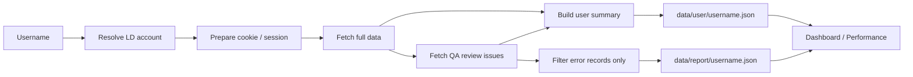

### Du lieu sau scan

| Folder | File name | Noi dung |
| :--- | :--- | :--- |
| `data/user` | `<username>.json` | Ho so user: username, user id, worker id, cookie/session status, total data, total records, pass/error, accuracy, error count, top errors, thoi diem scan |
| `data/report` | `<username>.json` | Report loi da loc: chi gom records/co noi dung loi QA, issue records, error summaries va thong tin de UI render cards |
| `data/scanner` | runtime files | Cookie user, log scan, run metadata va file tam trong qua trinh scan |
| `data/ld_memory` | memory files | Feedback/memory AI khi he thong hoc tu QA history |

### API scan chinh

```text
POST /api/qa/run_scanner
GET  /api/qa/scanner/{scanner_id}
GET  /api/qa/scanner_active
GET  /api/qa/accounts
GET  /api/qa/accounts/{username}/report
```

Scanner can quyen truy cap he thong LD noi bo khi chay thuc te. Khong commit cookie, session, report that hoac bat ky thong tin dang nhap nao.

---

## Kien Truc Repo

```text
LD/
├── backend/
│   ├── core/                  # Config, auth, identity helpers
│   ├── routes/                # FastAPI routes: auth, qa, chat, docs, draw, dashboard
│   ├── services/
│   │   ├── ld_ai/             # LD Brain, RAG, guard, reasoning, memory, LLM client
│   │   └── qa_scanner/        # Scanner backend-owned logic
│   └── storage/               # Public-safe catalog/assets/docs index when needed
├── frontend/
│   └── src/pages/             # Home, Login, Dashboard, Performance, Chat, Knowledge
├── data/                      # Runtime data; khong commit len public Git
├── docs/                      # Local/internal source docs; can loc truoc khi public
├── docker-compose.yml
├── requirements.txt
└── readme.md
```

---

## Quick Start

### 1. Cai dependencies backend

```bash
python -m venv .venv
.venv\Scripts\activate
pip install -r requirements.txt
```

### 2. Tao cau hinh backend local

Tao `backend/.env` tren may local. Khong commit file nay.

```env
LD_LLM_ENABLED=true
LD_LLM_PROVIDER=siliconflow
LD_LLM_BASE_URL=https://api.example.com/v1
LD_TEXT_MODEL=your-text-model
LD_VISION_MODEL=your-vision-model
LD_LLM_API_KEY=your-local-secret
```

Neu dung Ollama local, doi provider/base URL/model theo may dang chay.

### 3. Chay backend local

Frontend dev proxy hien tro ve `http://127.0.0.1:8001`, nen khi dev truc tiep co the chay backend o port nay:

```bash
cd backend
uvicorn main:app --reload --host 0.0.0.0 --port 8001
```

Health check:

```text
http://127.0.0.1:8001/api/ld/health
```

### 4. Chay frontend dev

```bash
cd frontend
npm install
npm run dev
```

Vite dev server:

```text
http://localhost:7789
```

### 5. Chay bang Docker Compose

```bash
docker compose up -d --build
```

Sau khi chay:

```text
Frontend: http://localhost:7789
Backend:  http://localhost:7788
```

Docker backend doc cau hinh tu `backend/.env` va mount runtime data vao `data/user`, `data/report`, `data/scanner`, `data/ld_memory`.

---

## Kiem Thu

Backend co cac test cho AI core, stream guard, drawing engine, login va feedback loop trong `backend/tests`.

```bash
python -m pytest backend/tests -q
```

Frontend build:

```bash
cd frontend
npm run build
```

Neu moi truong chua cai `pytest`, cai trong virtualenv truoc khi chay test. Khi test AI live, dam bao provider/model/API key da duoc cau hinh trong `backend/.env`.

---

## Public-Safe

Truoc khi day len Git, can dam bao repo khong chua secret hoac du lieu runtime that.

| Khong commit | Ly do |
| :--- | :--- |
| `.env`, `backend/.env`, `frontend/.env*` | Chua API key, endpoint rieng, token hoac cau hinh noi bo |
| `data/`, `tmp/`, `tools_local/` | Chua runtime scan, report that, sample session/cookie va file thu nghiem |
| `backend/storage/docs/`, `docs/*.docx`, `docs/*.xlsx` | Co the la tai lieu noi bo, chi public neu da duoc loc/sanitize |
| `__pycache__/`, `.venv/`, `node_modules/`, `frontend/dist/` | Artifact co the tai tao, khong can commit |
| Cookie/session/report JSON that | Co the tiet lo user, worker id, history scan hoac thong tin truy cap |

### Nguyen tac README public

- Mo ta kien truc, flow va cach build he thong.
- Khong ghi password, cookie, session, API key, host noi bo hoac du lieu scan that.
- Cac con so demo chi nen la public-safe hoac da duoc tong quat hoa.
- Tai lieu noi bo can duoc thay bang ban mau hoac ban da sanitize truoc khi commit.

---

## Trang Thai Kien Truc

| Hang muc | Trang thai | Ghi chu |
| :--- | :--- | :--- |
| QA scanner backend-owned | Done | Logic scan nam trong `backend/services/qa_scanner`, runtime nam trong `data/scanner` |
| User/report split | Done | User summary vao `data/user`, report loi vao `data/report` theo `<username>.json` |
| AI LD backend-owned | Done | Chat, stream, docs, drawing, feedback va memory deu qua FastAPI |
| Frontend dashboard | Done | Dashboard, detail, Performance, Chat, Knowledge doc data tu backend |
| Tool legacy cleanup | Ready | `tools_local` va cac file thu nghiem chi con gia tri tham khao neu khong duoc backend import |

<div align="center">

**LD Intelligence**  
QA Scan -> Error Report -> Performance Dashboard -> LD AI -> Feedback Memory

</div>
